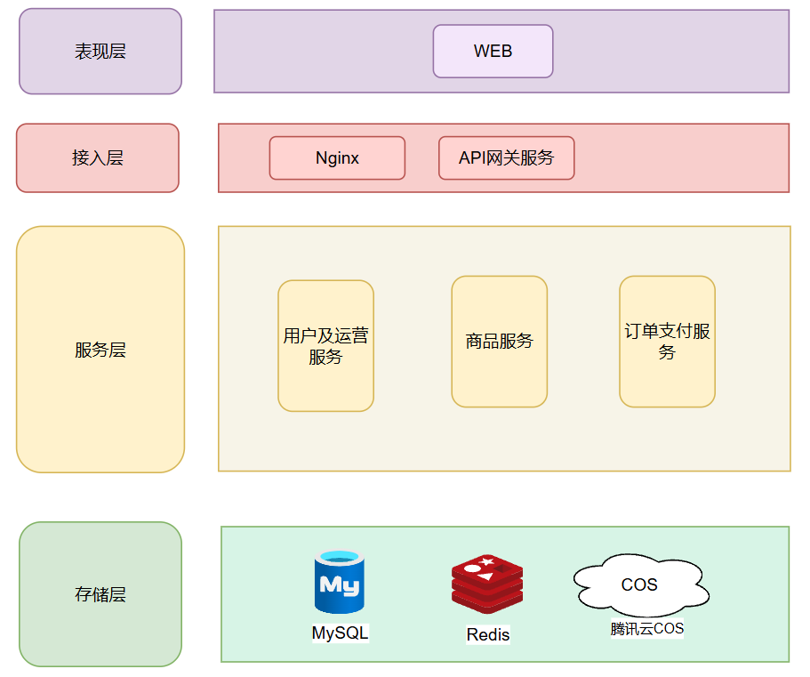
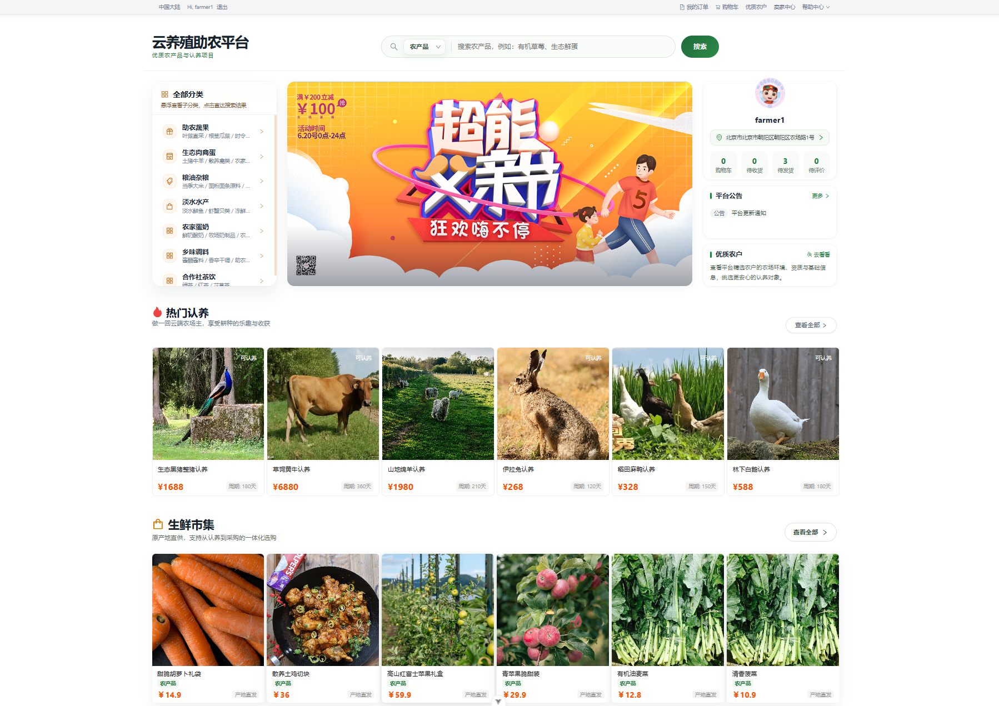
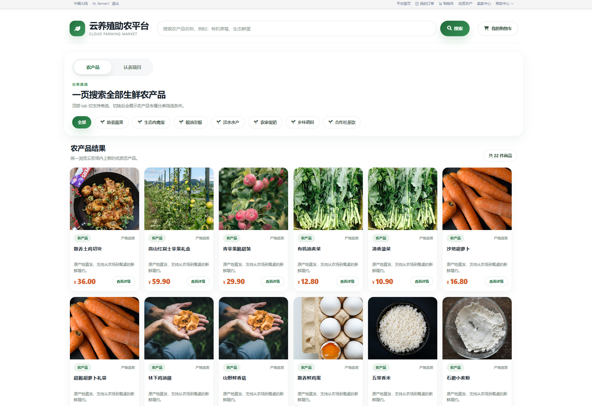
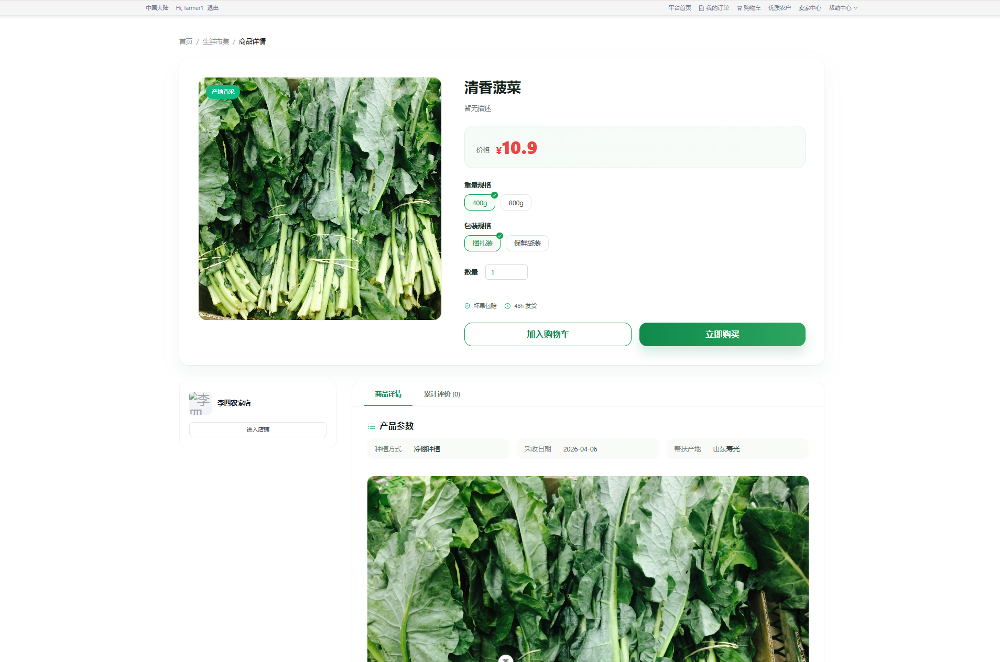
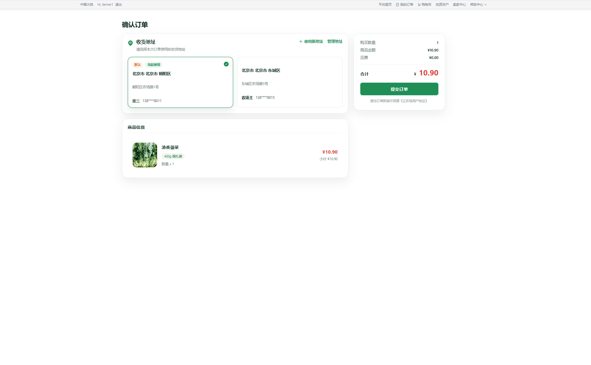

# 云养殖助农平台

## 项目介绍

云养殖助农平台是一个面向用户、农户和平台管理端的农业电商项目，围绕农产品销售、认养服务、购物车、订单支付、店铺运营、反馈处理等核心场景进行建设。

## 技术栈

### 后端技术栈

| 分类 | 技术 |
| --- | --- |
| 开发语言 | Java 17 |
| 核心框架 | Spring Boot 3、Spring Cloud、Spring Cloud Alibaba |
| 持久层 | MyBatis-Plus |
| 数据库 | MySQL |
| 缓存 | Redis、Redisson |
| 消息队列 | RabbitMQ |
| 认证鉴权 | Sa-Token |
| 分库分表 | ShardingSphere |


### 前端技术栈

| 分类 | 技术 |
| --- | --- |
| 核心框架 | Vue 3 |
| 构建工具 | Vite |
| 路由管理 | Vue Router |
| 状态管理 | Pinia |
| UI 组件库 | Ant Design Vue |
| HTTP 请求 | Axios |
| 包管理 | pnpm |
| Monorepo 工具 | Turborepo |

## 项目目录结构

```text
cloudfarming
├─ cloudfarming-vue/                前端工程
│  ├─ apps/
│  │  ├─ web/                       用户端前台
│  │  └─ admin/                     平台管理端
│  └─ package.json                  前端工作区配置
├─ frameworks/                      通用基础模块
│  ├─ common/                       公共工具、异常、通用响应等
│  ├─ database-spring-boot-starter/ 数据库与 MyBatis-Plus 基础配置
│  ├─ web-springboot-starter/       Web 层公共配置
│  ├─ cloudfarming-storage-spring-boot-starter/
│  │                                 文件存储相关能力
│  └─ idempotent-spring-boot-starter/
│                                    幂等能力封装
├─ services/                        微服务业务模块
│  ├─ user-operation-service/       用户、地址、反馈等相关服务
│  ├─ product-service/              商品、SKU、分类、店铺、购物车等服务
│  ├─ order-pay-service/            订单、支付、订单明细等服务
│  ├─ aggregation-service/          聚合服务（将其他微服务聚合在一起，若本地配置不足可以只启动网关 + 聚合服务）
│  └─ gateway-service/              网关服务，统一路由转发
├─ docs/                            项目文档
├─ resources/                       资源文件与附加材料
├─ pom.xml                          Maven 根聚合配置
└─ README.md                        项目说明文档
```
## 系统架构图


## 项目主要功能

### 用户端

- 商品浏览：商品列表、分类筛选、商品详情展示
- 商品购买：立即购买、购物车加购、确认订单、在线支付
- 订单管理：订单查询、订单详情、订单状态跟踪
- 店铺访问：查看店铺首页、店铺公告、店铺在售内容

### 认养业务

- 认养项目展示：认养项目列表、详情展示
- 认养下单：认养项目下单与支付
- 认养管理：我的发布、认养记录、认养详情查看

### 农户端

- 商品管理：创建商品、商品列表、上下架、商品信息修改
- SKU 管理：维护商品规格、价格、库存、图片等 SKU 数据
- 店铺管理：维护店铺名称、头像、横幅、简介、公告
- 数据统计：查看销售额、订单量等经营数据

### 订单与交易

- 购物车：商品加购、数量修改、勾选结算、批量删除、清空购物车
- 订单创建：购物车结算、立即购买结算、订单拆单
- 支付能力：订单支付、支付单生成、超时关闭兜底处理
- 售后流程：订单状态流转、待发货、已发货、已完成等状态管理

### 平台运营

- 后台管理：平台管理端基础运营与数据维护
- 商品审核：商品审核、上下架状态控制
- 反馈处理：意见反馈与投诉提交、后台处理反馈内容
- 公告与内容展示：店铺公告、平台页面内容展示

## 核心页面展示
首页截图


商品列表页面截图


商品详情页


确认订单页

